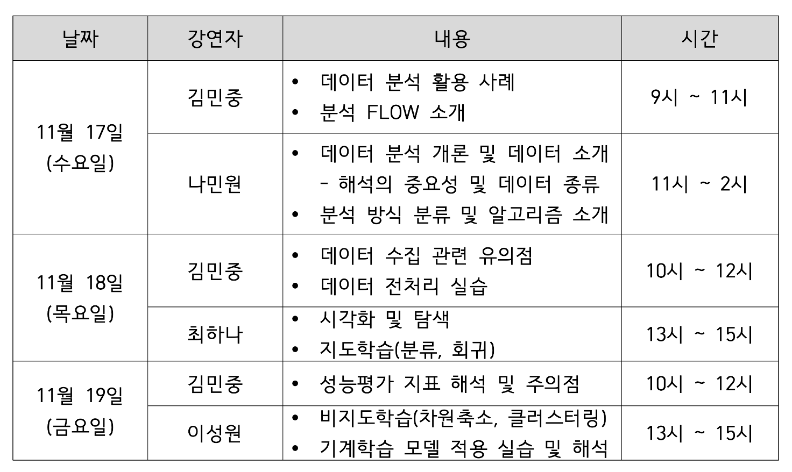

2021 AI 기술도입 빅데이터 분석 전문인력 양성 과정

2021년 11월 17일(수) ~ 19일(금)
장소: 대한철강(충남 당진시 신평면 원머리로 271)

진행: 김민중, 나민원, 최하나, 이성원 (국가수리과학연구소 산업수학혁신센터)

GitHub: https://github.com/mjgim/2021-jiuc-ai

3회차, 4회차 코드 다운로드: http://gofile.me/5ISXj/i52mGueIt

